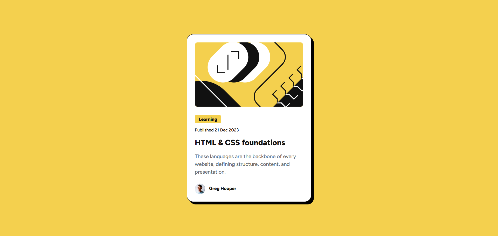
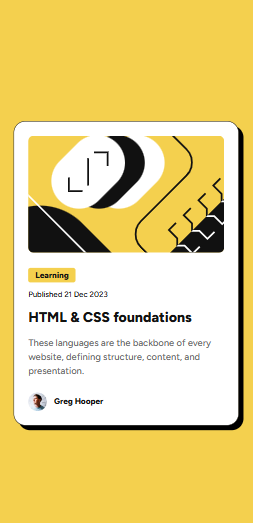

# Frontend Mentor - Blog preview card solution

This is a solution to the [Blog preview card challenge on Frontend Mentor](https://www.frontendmentor.io/challenges/blog-preview-card-ckPaj01IcS). Frontend Mentor challenges help me improve my coding skills by building realistic projects. 

## Table of contents

- [Overview](#overview)
  - [The challenge](#the-challenge)
  - [Screenshot](#screenshot)
  - [Links](#links)
- [My process](#my-process)
  - [Built with](#built-with)
  - [What I learned](#what-i-learned)
- [Author](#author)
- [Acknowledgments](#acknowledgments)

## Overview

### The challenge

To create a blog card component with img, category, publish date, title, description and card footer with author avatar and author name. And to change color of title on hover.

### Screenshot

### Links

- Solution URL: [https://github.com/AshuJojo/blog-preview-card](https://github.com/AshuJojo/blog-preview-card)

## My process

### Built with

- Semantic HTML5 markup
- CSS custom properties
- Mobile-first workflow

### What I learned

- How to upload custom fonts from static resources to CSS.
- Making use of semantic tags to improve accessebility and seo.
- Breaking CSS codes in organized & reusable manner.
 

## Author

- Github - [@AshuJojo](https://www.github.com/AshuJojo)
- Frontend Mentor - [@AshuJojo](https://www.frontendmentor.io/profile/AshuJojo)

## Acknowledgments

This project is made as a part of [Frontend Mentor](https://www.frontendmentor.io/) upskilling journey. 